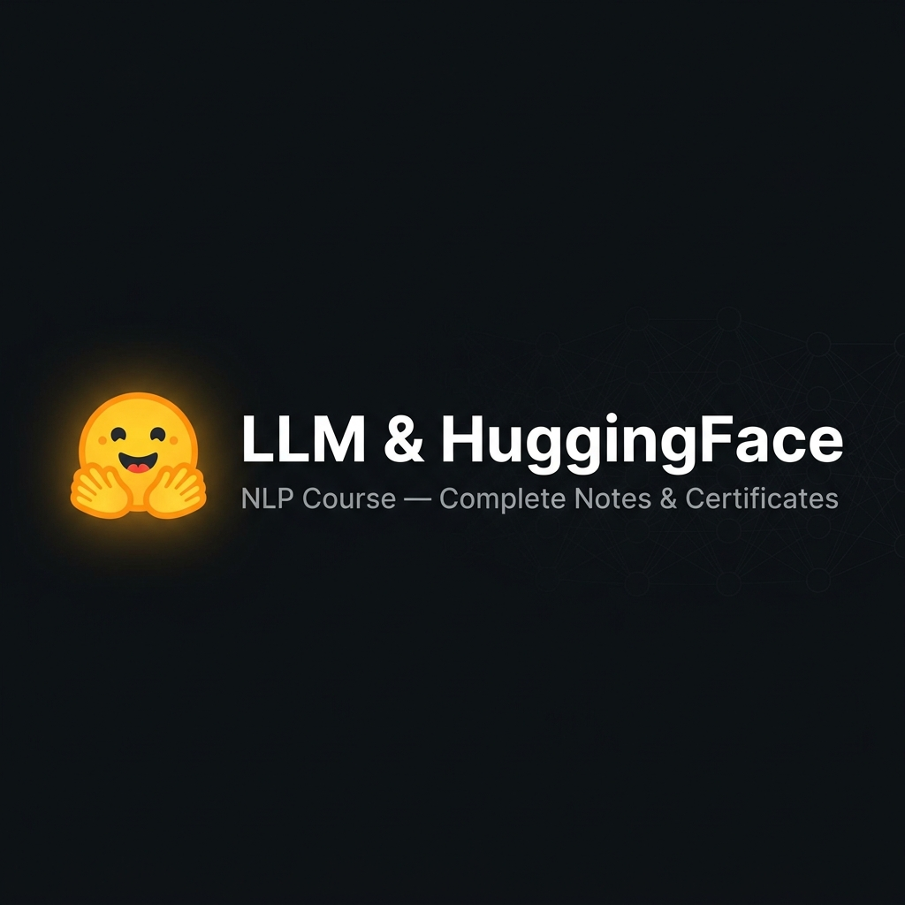

 

 

*Structured notes, certificates, and key learnings from the*
**[HuggingFace NLP Course](https://huggingface.co/learn/nlp-course/)** —
*covering transformer fundamentals through building autonomous reasoning agents.*

 

---

## 📚 Course Chapters

 

| # | Chapter | Core Topics |
|:---:|---------|-------------|
| `01` | **[Transformer Models](./Chapter_01_Transformer_Models/)** | Architecture · Self-Attention · BERT · GPT · T5 |
| `02` | **[Using Transformers](./Chapter_02_Using_Transformers/)** | Pipelines · AutoModel · AutoTokenizer · Inference |
| `03` | **[Fine-Tuning Pretrained Models](./Chapter_03_Fine_Tuning_Pretrained_Model/)** | Trainer API · Training Loop · Evaluation Metrics |
| `04` | **[Sharing Models & Tokenizers](./Chapter_04_Sharing_Models_Tokenizers/)** | HuggingFace Hub · Model Cards · `push_to_hub()` |
| `05` | **[The Datasets Library](./Chapter_05_Datasets_Library/)** | Loading · map/filter · Streaming · Custom Datasets |
| `06` | **[The Tokenizers Library](./Chapter_06_Tokenizers_Library/)** | BPE · WordPiece · Fast Tokenizers · Offset Mapping |
| `07` | **[Classical NLP Tasks](./Chapter_07_Classical_NLP_Tasks/)** | NER · Summarization · Translation · Text Generation |
| `08` | **[How to Ask for Help](./Chapter_08_How_To_Ask_For_Help/)** | Debugging · Minimal Reproducible Examples · Forums |
| `09` | **[Building & Sharing Demos](./Chapter_09_Building_Sharing_Demos/)** | Gradio · HuggingFace Spaces · Interactive UI |
| `10` | **[Curate High-Quality Datasets](./Chapter_10_Curate_High_Quality_Datasets/)** | Collection · Deduplication · Annotation · Ethics |
| `11` | **[Fine-Tune Large Language Models](./Chapter_11_Fine_Tune_LLMs/)** | LoRA · QLoRA · PEFT · RLHF · DPO |
| `12` | **[Build Reasoning Models](./Chapter_12_Build_Reasoning_Models/)** | Chain-of-Thought · ReAct · Tool Use · Agents |

 

---

## 🧠 Key Concepts Covered

 

<table>
<tr>
<td width="50%" valign="top">

**Architectures & Models**
- Encoder / Decoder / Encoder-Decoder
- BERT, GPT-2, T5, LLaMA
- Attention mechanisms
- Transfer learning

**Training & Fine-Tuning**
- HuggingFace `Trainer` API
- PyTorch custom training loops
- LoRA & QLoRA (PEFT)
- RLHF & Direct Preference Optimization

</td>
<td width="50%" valign="top">

**Data & Tokenization**
- BPE, WordPiece, Unigram
- `datasets` library pipelines
- Streaming large corpora
- Dataset curation & annotation

**Deployment & Agents**
- Gradio + HuggingFace Spaces
- HuggingFace Hub publishing
- ReAct agent framework
- `smolagents` autonomous agents

</td>
</tr>
</table>

 

---

## 🛠️ Stack

 

 

---

## 📄 References

 

| Paper | Link |
|-------|------|
| Attention Is All You Need (2017) | [arxiv.org/abs/1706.03762](https://arxiv.org/abs/1706.03762) |
| BERT (2018) | [arxiv.org/abs/1810.04805](https://arxiv.org/abs/1810.04805) |
| LoRA (2021) | [arxiv.org/abs/2106.09685](https://arxiv.org/abs/2106.09685) |
| QLoRA (2023) | [arxiv.org/abs/2305.14314](https://arxiv.org/abs/2305.14314) |
| ReAct (2022) | [arxiv.org/abs/2210.03629](https://arxiv.org/abs/2210.03629) |
| Chain-of-Thought (2022) | [arxiv.org/abs/2201.11903](https://arxiv.org/abs/2201.11903) |

 

---

Based on the official <a href="https://huggingface.co/learn/nlp-course/">HuggingFace NLP Course</a> · MIT License · <a href="https://github.com/shivanshu1512">@shivanshu1512</a>

